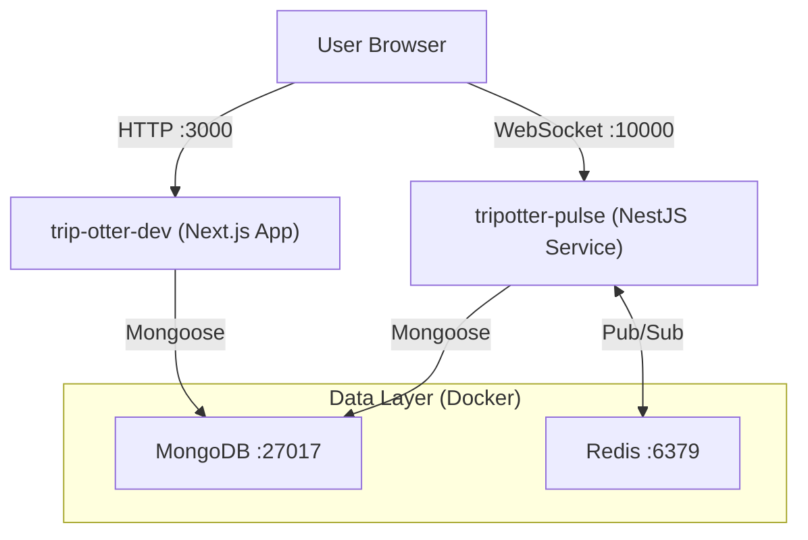

# TripOtter-Dev

The primary Next.js monolith for the TripOtter platform. This application handles User Interface, Authentication, and core CRUD operations.

It connects to the **tripotter-pulse** Microservice for real-time features.

## 🏗 System Architecture



## Project Structure

| Directory     | Description                                   |
| ------------- | --------------------------------------------- |
| `app/`        | Application source code (Next.js App Router). |
| `auth/`       | NextAuth.js configuration and providers.      |
| `components/` | Reusable UI components (including Shadcn UI). |
| `data/`       | Static data and mock JSONs.                   |
| `hooks/`      | Custom React hooks.                           |
| `lib/`        | Utility libraries and helper functions.       |
| `sanity/`     | Sanity CMS schema and configuration.          |
| `styles/`     | Global CSS and Tailwind configurations.       |
| `types/`      | TypeScript type definitions and interfaces.   |
| `utils/`      | General helper functions and formatters.      |

:::warning STOP & READ
This repository requires **pnpm**.

**Do NOT use npm or yarn** (will cause dependency locks to break).

If you do not have pnpm:

```bash
npm install -g pnpm
```

:::

## Quick Start Guide

### 1. Prerequisites

Ensure you have the infrastructure running via Docker:

```yaml
services:
  # The MongoDB Service
  mongo:
    image: mongo
    restart: always
    ports:
      - "27017:27017"
    volumes:
      - mongo-data:/data/db

  # The Redis Service
  redis:
    image: redis
    restart: always
    ports:
      - "6379:6379"

volumes:
  mongo-data:
```

```bash
# Verify MongoDB (27017) and Redis (6379) are up
docker ps
```

### 2. Installation

```bash
pnpm install
```

### 3. Environment Configuration

Create a `.env.local` file in the root:

```properties
# --- Connectivity ---
MONGODB_URI="mongodb://localhost:27017/tripotter"
NEXT_PUBLIC_API_BASE_URL="http://localhost:3000/api"

# --- Pulse Service (Real-time) ---
# Must match the PORT used in the Pulse repo
WS_BASE_URL="http://localhost:10000"
PULSE_BASE_URL="http://localhost:10000"
NEXT_PUBLIC_PULSE_BASE_URL="http://localhost:10000"
NEXT_PUBLIC_WS_BASE_URL="http://localhost:10000"

# --- Auth Secrets ---
NEXTAUTH_URL="http://localhost:3000"
NEXTAUTH_SECRET="dev-secret-key"
```

### 4. Run the Development Server

```bash
pnpm dev
```

The app will be available at [http://localhost:3000](http://localhost:3000).

## 🛠 Troubleshooting

| Error                          | Solution                                           |
| ------------------------------ | -------------------------------------------------- |
| `bcrypt` or `sharp` crash      | Run `pnpm rebuild` to compile C++ binaries.        |
| Connection Refused (WebSocket) | Ensure `tripotter-pulse` is running on port 10000. |
| ERESOLVE Error                 | Ensure you are using **pnpm**, not npm.            |
